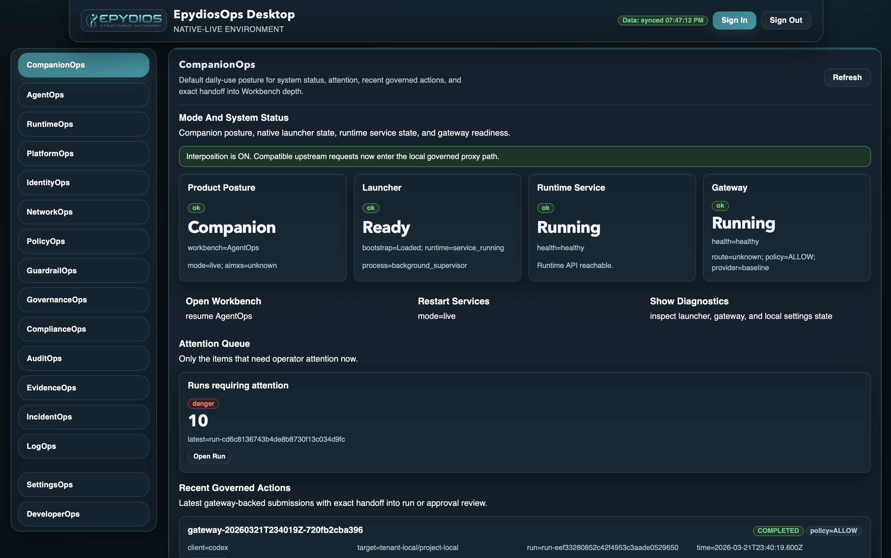
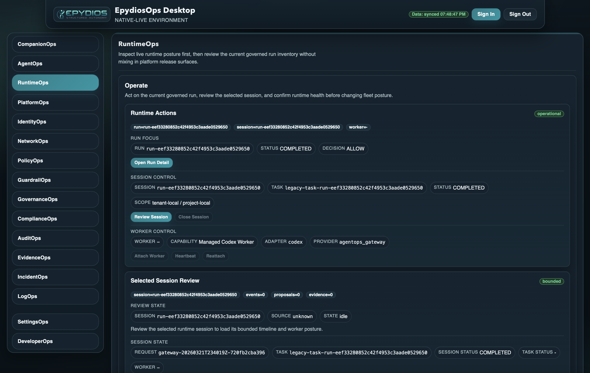

# EpydiosOps

EpydiosOps is an installable operator desktop for governed AI and tool execution.

It puts `Companion` in front of requests that are usually buried in middleware and opens `Workbench` only when the run needs deeper runtime, audit, evidence, or incident review.



## Start Here

The public repo has one canonical proof lane: the installed macOS desktop.

From the repo root:

```bash
./platform/ci/bin/qc-preflight.sh
./ui/desktop-ui/bin/check-m1.sh
./ui/desktop-ui/bin/verify-m15-phase-c-governed-request.sh
```

It proves:

- the repo baseline is green
- the desktop module is sane
- the macOS app can be packaged and launched
- `Interposition OFF / ON` is explicit
- one governed Codex `/responses` request runs end to end
- approval resolution, audit, and evidence handoff are real



## Current OSS Posture

- macOS `live` installed desktop is the supported lane
- Linux ships repo-committed Ubuntu 24.04 beta packaging, install, and verification surfaces
- Windows ships repo-committed beta packaging, install, and verification surfaces

## What This Repo Contains

- [ui/desktop-ui/](ui/desktop-ui) - installable operator desktop, launcher, and localhost gateway
- [internal/](internal) and [cmd/](cmd) - governed runtime services and service entrypoints
- [contracts/extensions/v1alpha1/](contracts/extensions/v1alpha1) - public provider boundary
- [platform/](platform) - local bootstrap, CI, and verification
- [clients/](clients) and [examples/](examples) - ingress clients and example integrations

## Read Next

- [Getting started](docs/getting-started.md)
- [OSS quality story](docs/quality-story.md)
- [Desktop module guide](ui/desktop-ui/README.md)
- [Release policy](docs/release-policy.md)
- [OSS versus premium policy](docs/oss-premium-policy.md)

## Trust, Policy, And Contribution

- [LICENSE](LICENSE)
- [SECURITY.md](SECURITY.md)
- [CONTRIBUTING.md](CONTRIBUTING.md)
- [TRADEMARK.md](TRADEMARK.md)
