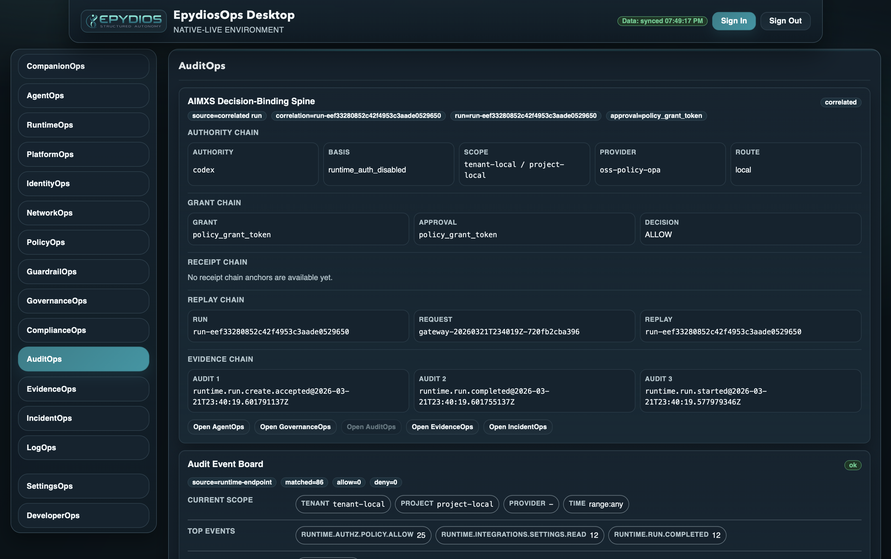

# EpydiosOps Agent Operations Plane

Installable operator desktop and local governance plane for agent and tool execution.

EpydiosOps gives teams a visible control plane for AI and tool execution. It combines an installable desktop operator console, a local launcher and supervisor, a loopback gateway, and a governed runtime path for policy enforcement, receipts, audit, evidence, incident review, and operator action.


Sentry seal says: security is seal-d. 

If this looks useful, please consider giving the repo a star. It helps more people discover the project, use it and contribute to making it better.

## Why EpydiosOps

- Governed execution with a real operator surface instead of a hidden background policy layer.
- Local request-path control through an explicit desktop launcher and loopback gateway.
- First-class runtime, governance, audit, evidence, incident, and settings surfaces.
- Installable desktop workflow for live operator use, not just a browser demo path.
- Public contracts and OSS baseline providers that remain usable without premium artifacts.

## Open Source

This repository contains the public control plane, desktop app, native launcher, localhost gateway, public provider contracts, baseline OSS providers and the operator surfaces required to inspect and govern execution locally.

The desktop product currently opens in a live `Companion` posture for day-to-day operation and includes the deeper `Workbench` surface for review, runtime, audit, evidence and incidents.

## How EpydiosOps Is Used

EpydiosOps is not just an interposition layer.

Teams can use it in three primary ways:

- as an installable operator desktop for runtime, governance, audit, evidence, incident, and settings work
- as a local gateway and SDK surface for governed execution from tools, scripts, and clients
- as an explicit in-path control layer for supported clients when local interposition is intentionally enabled

## Upcoming

We are building EpydiosOps toward a more complete agent operations plane for both individual operators and serious organizational use.

Upcoming EpydiosOps editions are aimed at teams that need a more mature decision layer, stronger governance depth, richer evidence and approval packs, private connector paths for higher-consequence systems and enterprise distribution and support.

We are continuously squashing bugs and adding features. 

## Getting Started

- [Getting started](docs/getting-started.md)
- [OSS quality story](docs/quality-story.md)
- [Desktop module guide](ui/desktop-ui/README.md)
- [Release policy](docs/release-policy.md)

## Install And Evaluate

If you want a quick repository-level confidence pass:

```bash
./platform/ci/bin/qc-preflight.sh
./ui/desktop-ui/bin/check-m1.sh
```

If you are on macOS and want the verified installed desktop path:

```bash
./ui/desktop-ui/bin/install-m15-macos-beta.sh
./ui/desktop-ui/bin/verify-m15-phase-c.sh
open "$HOME/Applications/Epydios AgentOps Desktop.app"
```

If you are on Linux and want to evaluate the beta installed desktop path:

```bash
./ui/desktop-ui/bin/bootstrap-m15-linux-ubuntu.sh
./ui/desktop-ui/bin/install-m15-linux-beta.sh
./ui/desktop-ui/bin/verify-m15-linux-beta.sh
./ui/desktop-ui/bin/launch-m15-linux-beta.sh
```

If you are on Windows and want to evaluate the beta installed desktop path:

```bash
bash ./ui/desktop-ui/bin/install-m15-windows-beta.sh
bash ./ui/desktop-ui/bin/launch-m15-windows-beta.sh
```

The primary verified installed operator path today remains macOS.

Linux has a proven Ubuntu 24.04 x86_64 host-acceptance path.

Windows packaging exists, but a Windows host acceptance pass remains pending.

## Screenshots

### Companion


### Governed Request Flow


### Audit And Evidence



## Product Shape

EpydiosOps currently consists of:

- an installable desktop UI
- a local launcher and background runtime supervisor
- a loopback localhost gateway
- a governed runtime path for requests, runs, receipts and review
- operator surfaces for runtime, governance, audit, evidence, incidents

## Current Client Scope

The first proven interposition path in the public repository is the Codex and OpenAI-compatible `/responses` flow through the local gateway.

That is the current leading path, not the only intended one. The operator desktop and local gateway are designed to support additional client surfaces over time. If you have a certain agent that we should look at, please let us know. Anthropic, Google, AWS and other are all planned. 

## Future Directions

We are building EpydiosOps toward a more complete agent operations plane for both individual operators and serious organizational use. Near-term work includes:

- stronger enterprise readiness, including deployment maturity, operational controls and integration depth
- expanding supported client paths beyond the first Codex-compatible interposition flow
- continuing Companion and Workbench polish for daily operator use
- strengthening installed desktop workflows across platforms
- improving native-first control flows so less operator work depends on fallback or development paths
- deeper governance and decision quality
- richer audit, evidence and incident workflows
- more polished desktop installs and platform support
- a larger SDK and integration surface for tools, gateways, and providers

## Repository Guide

- [cmd/](cmd) - control-plane and provider entrypoints
- [internal/](internal) - runtime, orchestration, provider routing, and gateway logic
- [contracts/extensions/v1alpha1/](contracts/extensions/v1alpha1) - public provider contract surface
- [platform/](platform) - deployment modes, local bootstrap, CI gates, and verification
- [ui/desktop-ui/](ui/desktop-ui) - desktop UI, launcher, native packaging, and localhost gateway
- [examples/](examples) - example provider registration and deployment material

## Trust, Policy, And Contribution

- [OSS quality story](docs/quality-story.md)
- [OSS versus premium policy](docs/oss-premium-policy.md)
- [Release policy](docs/release-policy.md)
- [LICENSE](LICENSE)
- [SECURITY.md](SECURITY.md)
- [CONTRIBUTING.md](CONTRIBUTING.md)
- [TRADEMARK.md](TRADEMARK.md)
- [THIRD_PARTY_NOTICES.md](THIRD_PARTY_NOTICES.md)
